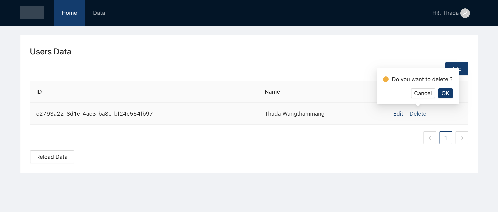
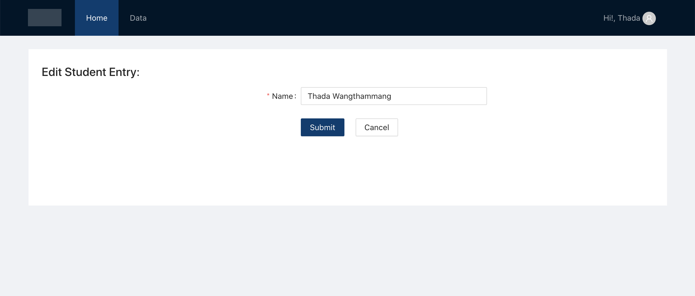

# Users Admin with Simple CRUD Redux Toolkit (Typescript)

## Features
- React Router
- Service (JSON API using `axios`) 
- Store (Redux Toolkit)
- UI Component ( Ant Design)
- Create react app wrapper (Craco for less compiler (ant design))
- Responsive navbar (using Drawer for mobile)

## Start

```
yarn dev
```

## Screenshot

### Read 
`src/features/admin/users/UsersPage.tsx`


### delete 



### Add 
`src/features/admin/users/UsersAddForm.tsx`


### edit 
`src/features/admin/users/UsersEditForm.tsx`




## Command

```
# Start app
yarn start

# Running mock server (json-server)
yarn mock 

# Run both mock and app
yarn dev
```

This project was bootstrapped with [Create React App](https://github.com/facebook/create-react-app).

Use Redux Toolkit (https://redux-toolkit.js.org/tutorials/advanced-tutorial)

https://codesandbox.io/s/rtk-github-issues-example-03-final-ihttc?from-embed=&file=/src/features/issuesList/issuesSlice.ts:1494-1511

